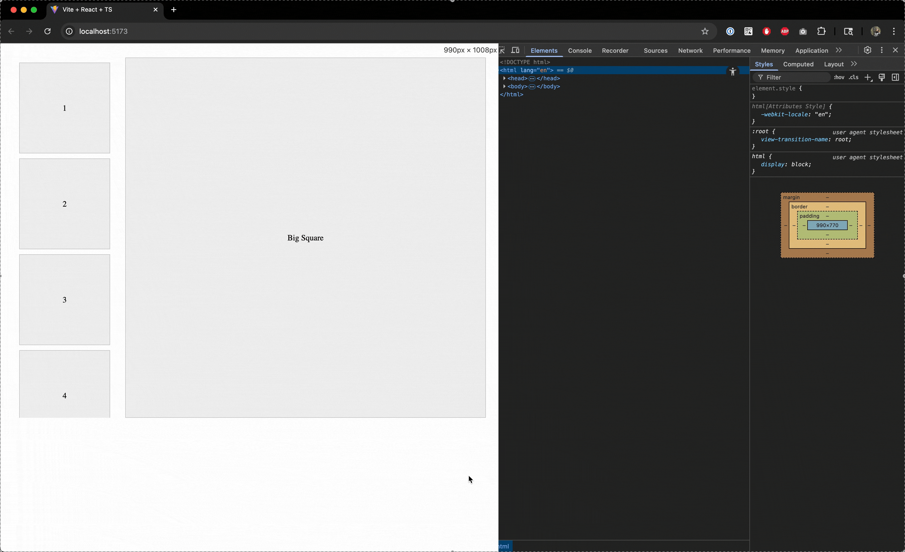

# Responsive Reorder Demo

## Tl;Dr:

1. Claude Code is amazing and speeds up both my learning and general development work.
2. I don't trust it yet - or my prompting could improve - to produce a result that follows best practices. I currently prefer to point it's generation somewhere other than the code I'm specifically working on. I am still experiementing to see how it improves and how I can better utilize it!

## Background

I was learning to build a layout in CSS and got stumped for a minute trying to achieve a specific responsive reordering behavior. When I asked my teammates, they were also stumped on how to do it.

When I got home, I tried out Claude Code and was amazed that in only 2-3 prompts, Claude Code generated a working example from scratch of what I was looking for. Between asking Claude questions and looking through this codebase, I essentially have a highly-curated version of StackOverflow. This exercise taught me how to achieve the exact behavior I was looking for which I was able to translate back into our codebase. It also showed me a CSS pattern like using `absolute` with a `relative` parent together to lay things out nicely.

## The Result:

This worked so well I used it again when the height of the thumbnail carousel wasn't sticking to the expanded/collapsed size of the hero image.

Here's the result of that one, that I also translated into Tailwind.

